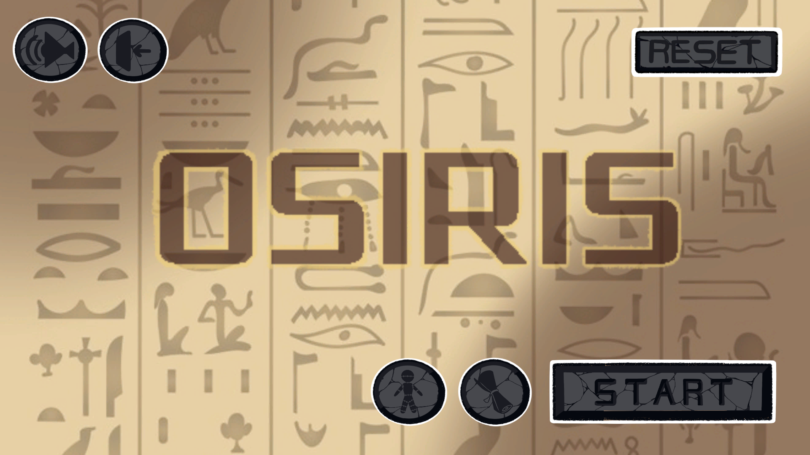
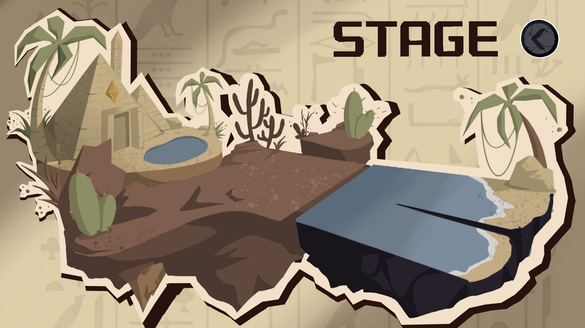
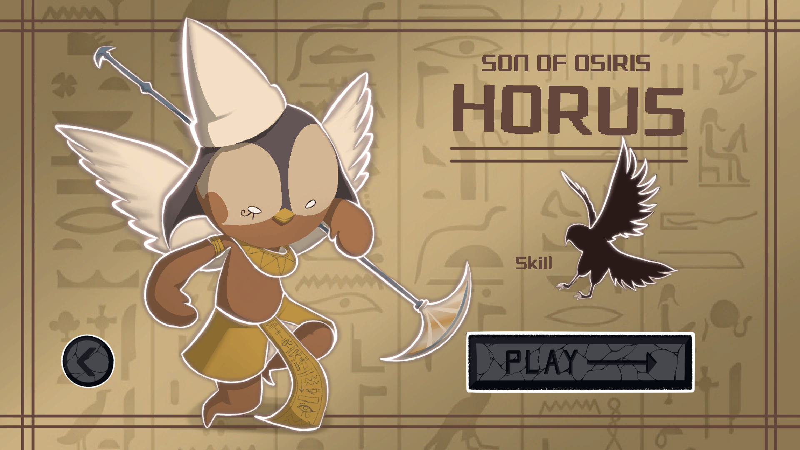
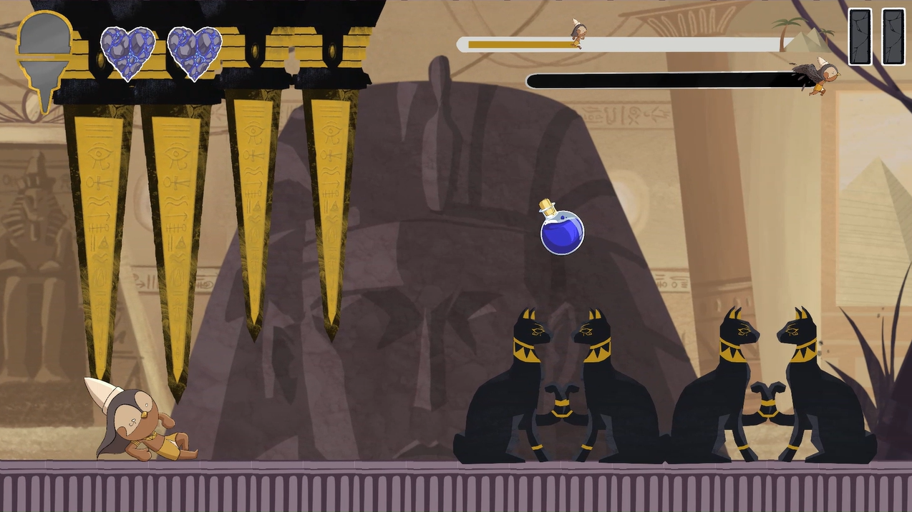
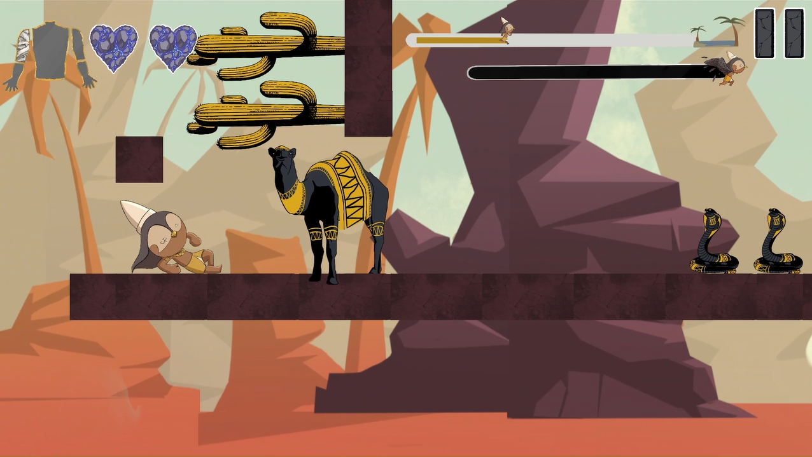
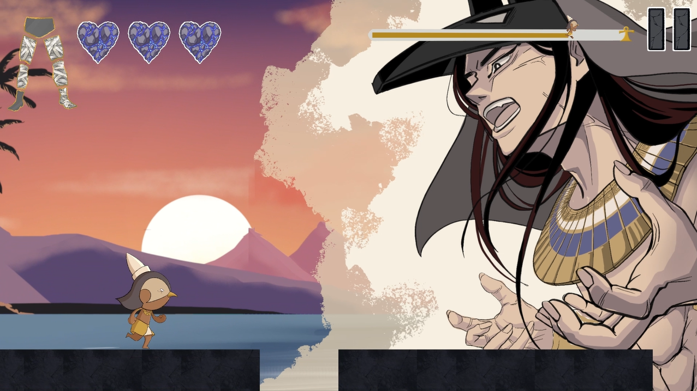

## 목차
- [개요](#개요)
- [시놉시스](#시놉시스)
- [게임 플레이 방식](#게임-플레이-방식)
- [게임 플레이 화면](#게임-플레이-화면)

  

## 개요
- 게임 장르 : 2D 횡스크롤 러닝 게임 (3인칭 사이드뷰)
- 개발 엔진 및 언어 : Unity, C#
- 플랫폼 : PC
- 개발 기간 : 2024.07.05-2024.08.18

  |팀원 소개|-|
  |:--|:-:|
  |프로그래밍|구은서, 차서연|
  |아트|강지원, 최서진|

  

## 시놉시스
<i><b>태양신 라가 세상을 창조한 후 게브와 누트를 창조하였다. 

그들의 자녀는 4남매로, 오시리스와 이시스가 반려가 되었으며, 세트와 네프티스가 짝을 이루었다. 

오시리스는 생사, 풍요를 관장하는 신이었으며 '전능한 자'라는 이름을 가졌다. 오시리스는 이집트의 왕이자 신으로서 군림해
사람들의 절대적인 지지를 받았으며 황금기를 이끄는 신이었다. 

하지만 그의 남동생 세트는 모든 존경과 지지를 독차지하는 오시리스를 끊임없이 시기했다. 

세트는 기회를 엿보다 오시리스를 죽이는 데 성공했고, 오시리스의 시체를 14조각으로 토막 내어 이집트 전역에 흩뿌렸다. 

슬픔에 잠긴 이시스를 뒤로 하고 오시리스와 이시스의 아들인 호루스가 아버지의 시체를 찾아 나서는데,,,,,</i><b>

  

## 게임 플레이 방식
|점프|2단 점프|슬라이드|
|:-:|:-:|:-:|
||||

|스킬 물약|시체 획득|
|:-:|:-:|
|||

  

## 게임 플레이 화면
|게임 시작 화면|맵 선택 화면|플레이어 선택 화면|
|-|-|-|
||||

|스테이지 1|스테이지 2|스테이지 3|
|-|-|-|
||||
